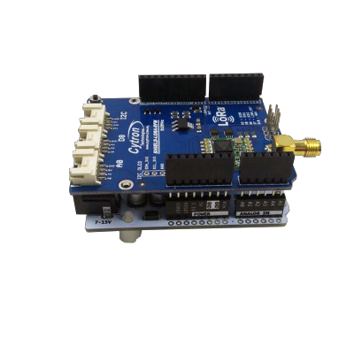
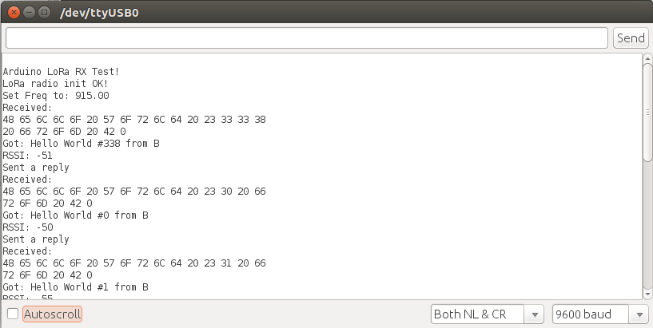

# Getting Started
This is an example tutorial of point-to-point wireless communication between 2 Arduinos using Cytron RFM LoRa Shields.

## Overview
1. [Basic Requirements](#basic-requirements)
2. [Hardware Setup](#hardware-setup)
3. [Library Installation](#library-installation)
4. [Uploading Sketches](#uploading-sketches)
5. [Arduino Sketches Overview](Arduino-Sketches-Overview)
6. [Screenshots](#screenshots)

## Basic Requirements
1. 2 [Cytron RFM LoRa Shields](http://www.cytron.com.my/p-shield-lora-rfm)
2. 2 Arduino-compatible boards
3. USB cable/accessories to upload Arduino program
4. [Arduino IDE software](https://www.arduino.cc/en/Main/Software)

## Hardware Setup
1. Stack Cytron RFM LoRa Shield onto Arduino compatible board with antenna installed as shown in picture below. In this case we are using [CT-UNO](http://www.cytron.com.my/p-ct-uno).
2. Prepare **2** sets for this.

## Pictures

**CT-UNO with LoRa Shield on top**

**CT-UNO with LoRa Shield and antenna installed**

## Library Installation
1. Download the zip file from [here](https://github.com/CytronTechnologies/RadioHead).
2. Open Arduino IDE, go to **Sketch > Include Library > Add .ZIP Library**, choose the downloaded zip file and click Open.

## Uploading Sketches

1. Download the Arduino sketches as zip files **OR** git clone this repo from [here](https://github.com/CytronTechnologies/RFM-LoRa-Shield-Examples).
2. Grab one set of RFM LoRa Shield + Arduino that you have setup just now. We call it as **Arduino LoRa Client**.
3. Open and upload ``rf95_client.ino`` sketch to **Arduino LoRa Client**.
4. Grab another set of RFM LoRa Shield + Arduino that you have setup just now. We call it as **Arduino LoRa Server**.
5. Open and upload ``rf95_server.ino`` sketch to **Arduino LoRa Server**.

## Arduino Sketches Overview

> Refer [here](Arduino-Sketches-Overview).

## Screenshots
* 
<b>Arduino LoRa Server</b>

* 
<b>Arduino LoRa Client</b>

